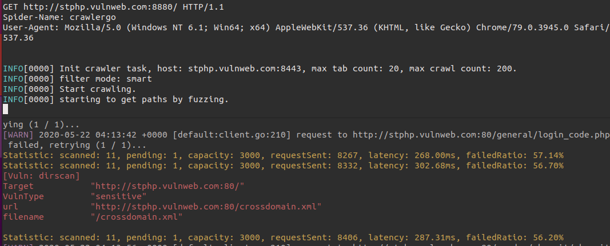
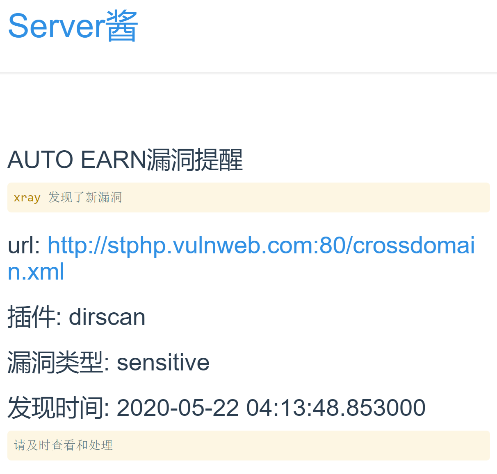
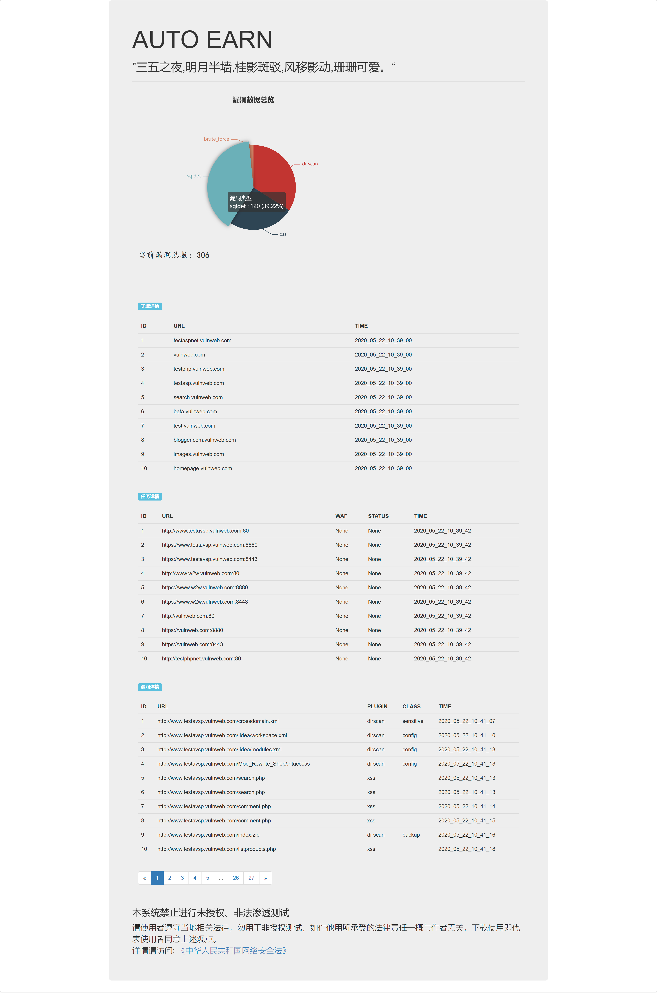

# AUTO-EARN
[](https://www.python.org/)


## 闲言碎语

在平时的`漏洞挖掘`过程中经常会有些`Fuzz`的需要，而`自动化工具`一直是各大`SRC`榜首师傅的利器，会凭借的经验与工具集合形成一套自己行之有效的漏洞探测方法，也看到了各位师傅类似于[Watchdog](https://github.com/CTF-MissFeng/Watchdog)的自动化工具，其中有很多思想碰撞的地方，自己也试着写了一版基于`Django`的分布式节点的工具，但是还是感觉差强人意，其中有很多问题，例如写出来东西耦合度太高，每个人的信息收集方式方法不同，利用的工具框架也有差别，而且当自己框架中的组件发生`更新`或者`替换`时感觉有些繁琐，因此就简单的构建了这么一个算是`流程框架`的工具，提供标准的接口与流程，大家可以自行按照个人喜好进行`工具`的`更新`与`替换`，可以结合自己的需求对代码进行相应的变更，编写过程中更多的是以某个工具为例，因为优秀的工具实在是太多了，比如就`被动扫描器`来说，[Xray](https://github.com/chaitin/xray)与[w13scan](https://github.com/w-digital-scanner/w13scan)分别具有自身的优点与长处，个人就是站在巨人的肩膀上窥探了一下各位师傅对于相关内容的见解，开发文档之后也会整理成一篇`从零写一个自动化漏洞猎人`的文档，权当是`Debug`笔记，希望能与各位师傅多多学习，文档地址：[从零写一个自动化漏洞猎人](从零写一个自动化漏洞猎人.md)

因为是一个`样例版本`，因此代码中很多地方只是举了一两个例子，欠缺部分还很多，比如，高并发方面没有做出太好的调整，过分依赖`爬虫`效果以及`被动扫描器`的扫描规则，对于一些逻辑漏洞没有行之有效的判断方法，信息收集也是很粗糙，值得深入研究细化每一个小小的部分都可以拿出来当作一个专门要去学习和深究的方向，还希望可以抛砖引玉，看到师傅们更高的产出。

如果您也有什么想法或者建议，可以联系`echocipher#163.com`，期待与您交流

## 扫描样例


本次扫描样例来自于[vulnweb](vulnweb.com)，动态结果展示可访问：https://www.echocipher.life/autoearn.html

## 目录结构

```
│  app.py  //前台展示
│  autoearn.py  //程序入口
│  README.md
│  requirements.txt  
│  server.py  //漏洞推送、通知提醒
│  start.sh  //启动相关程序、日志记录
│  stop.sh
│  subdomain_monitor.py  //子域收集监控、数据库保存
│  target.txt  //目标文件
│  
├─lib //插件目录
│      check_cdn.py  //cdn检查模块
│      config.py  //配置模块
│      craw_to_xray.py  //爬虫、漏洞抓取模块
│      port_check.py  //端口检测模块
│      read_target.py  //目标读取模块
│      run_html.py  //前台启动模块
│      server_push.py  //消息通知模块
│      sql_connect.py  //数据库相关模块
│      subdomain_collect.py  //子域收集模块
│      waf_check.py  //waf检测模块
│      __init__.py
│      
├─logs
│      oneforall.log  //oneforall日志
│      server.log  //漏洞推送日志
│      subdomain_monitor.log //子域收集监控日志
│      xray.log
│      
├─pic
│  └─README
│          
├─results
│      result.sqlite3  //数据库
│      
├─templates
│      index.html //主页文件
│      
└─tools
    ├  crawlergo  //一个使用chrome headless模式进行URL入口收集的动态爬虫
    ├  chrome  //chrome浏览器
    ├  masscan //异步传输，无状态的扫描端口工具             
    ├  OneForAll  //一款功能强大的子域收集工具                      
    ├  wafcheck  //WAF指纹识别工具             
    └  xray  //一款躺着收洞的神器
```


## 工具流程

`AUTO-EARN`是一个利用[OneForAll](https://github.com/shmilylty/OneForAll)进行子域收集、[Shodan API](https://www.shodan.io/?language=en)端口扫描、[Wafw00f](https://github.com/EnableSecurity/wafw00f)进行WAF指纹识别、[Xray](https://xray.cool/xray/)漏洞Fuzz、[Server酱](http://sc.ftqq.com/3.version)的自动化漏洞扫描、由`Flask`支撑一个简单可视化界面，即时通知提醒的漏洞挖掘辅助工具，本质上更像是一个流程框架，完成各工具之前的自动化联动过程，这个工具执行流程如下


首先通过`target.txt`读取到`目标`之后，由`OneForAll`后台进行子域名收集过程，然后通过`subdomain_monitor.py`进行监控，监测子域收集过程是否完成，完成后会通过`server酱`进行消息推送，并且存入本地数据库中的`SUBDOMAIN`表


在收集子域完成后，通过`端口检测`进行端口检测，目的是发现那些开放在其它端口上的`web`系统，从而能更全面的进行后续的检测，在端口检测过程中会首先读取`SUBDOMAIN`表中的`URL`字段，通过`check_cdn.py`进行`CDN检测`，之后不存在`CDN`的目标再利用`shodan api`进行`端口检测`以及`服务识别`的过程，然后将检测到的目标按照`协议:DOMAIN:端口`的格式存储到`TASK`表中，如果目标存在`CDN`则默认返回`80`端口存储到`TASK`表中


之后`WAF检测`过程会对`TASK`中的每个目标通过`Wafw00f`进行指纹识别，并且修改`TASK`表中的`WAF`字段，这里大家可以根据自己的需求再进行更改，比如舍弃存在`WAF`的目标


`Fuzz`阶段会首先调用[crawlergo](https://github.com/0Kee-Team/crawlergo)使用`chrome headless`模式进行URL入口收集，我们可以利用`--push-to-proxy`来连接我们的被动扫描器[xray](https://github.com/chaitin/xray)进行漏洞扫描， `xray` 有一种漏洞输出模式叫 `webhook-output`，在发现漏洞的时候，将会向指定的 `url`以 `post`的方式传输漏洞数据，之后我们通过搭建一个 `web` 服务器，接收到 `xray` 发送的漏洞信息，然后在将它转发，我们借助于 `Python` 的 `flask` 框架构造了`server.py`，接下来就是解析 `xray` 的漏洞信息，然后生成对应的页面模板，之后通过`server酱`我们就可以将漏洞信息推送到我们的微信中


并且我们模板中的相应字段我们会存储在`VULN`表中

之后我们会利用`app.py`生成一个`index.html`，我们就可以通过`查看`功能来查看数据库内相应的字段，并且利用`Echarts`进行数据可视化过程


## 配置安装

### 手工安装

#### Python

由于`OneForAll`基于[Python 3.8.0](https://www.python.org/downloads/release/python-380/)开发和测试，请使用高于`Python 3.8.0`的稳定发行版本，其他版本可能会出现一些问题（`Windows`平台必须使用`3.8.0`以上版本），安装`Python`环境可以参考[Python 3 安装指南](https://pythonguidecn.readthedocs.io/zh/latest/starting/installation.html#python-3)。运行以下命令检查`Python`和`pip3`版本：

```
python3 -V
pip3 -V
```

如果你看到以下类似输出便说明Python环境没有问题：

```
Python 3.8.0
pip 19.2.2 from C:\Users\shmilylty\AppData\Roaming\Python\Python38\site-packages\pip (python 3.8)
```

#### Git克隆部署

```
# Github地址
git clone https://github.com/Echocipher/AUTO-EARN
# Gitee地址（国内速度块）
git clone https://gitee.com/echocipher/AUTO-EARN
```

#### 依赖安装

```
cd AUTO-EARN/
python3 -m pip install -U pip setuptools wheel -i https://mirrors.aliyun.com/pypi/simple/
pip3 install -r requirements.txt -i https://mirrors.aliyun.com/pypi/simple/
```

#### 相关配置

1. `chrome`请按照自己系统版本进行下载安装，放置在`./tools/chrome`中，或者在`./lib/config.py`中修改相应的位置，`crawlergo `只依赖`chrome`运行即可，前往[下载](https://www.chromium.org/getting-involved/download-chromium)新版本的`chromium`，或者直接[点击下载Linux79版本](https://storage.googleapis.com/chromium-browser-snapshots/Linux_x64/706915/chrome-linux.zip)。`chrome`相关纠错可以按照[Trouble Shooting](https://github.com/0Kee-Team/crawlergo#trouble-shooting)进行修改。

   

2. `OneForAll`相关配置在`./tools/OneForAll`目录中按照[OneForAll文档](https://github.com/shmilylty/OneForAll)按需进行个人配置即可

3. 在`./lib/config.py`中按照自己的需求对`server酱`、`shodan api`等进行配置

   ```
   '''
   AUTOEARN配置
   '''
   # 目标文件位置
   target_file_path = 'target.txt'
   # OneForAll相关配置
   oneforall_path = './tools/OneForAll/oneforall.py'
   # OneForAll数据库位置
   oneforall_sql_path = './tools/OneForAll/results/result.sqlite3'
   # Server酱SCKEY (http://sc.ftqq.com/?c=code)
   sckey = "https://sc.ftqq.com/{你的key}.send"
   # subdomain_status_check间隔时间
   server_sleep_time = 10
   # autoearn数据库位置
   result_sql_path = './results/result.sqlite3'
   #shodan API
   SHODAN_API_KEY = '{你的key}'
   # masscan位置
   masscan_path = './tools/masscan/bin/masscan'
   # masscan端口扫描范围
   masscan_port = '1-65535'
   # masscan临时文件保存位置
   masscan_file = './results/masscan.json'
   # masscan速率
   masscan_rate = '1000'
   # 端口最大数目阈值
   port_num_max = 50
   # wafw00f位置
   wafw00f_path = './tools/wafcheck/main.py'
   # crawlergo位置
   crawlergo_path = './tools/crawlergo'
   # chrome位置
   chrome_path = "./tools/chrome/chrome"
   # 爬虫同时开启最大标签页，即同时爬取的页面数量。
   max_tab_count = "20"
   # 发送爬虫结果到监听地址时的最大并发数
   max_send_count = "10"
   # Xray被动代理地址
   push_to_proxy = "http://127.0.0.1:7777"
   # 端口检查线程数
   port_check_thread_num = 10
   # 主页默认每页显示数目
   PER_PAGE = 10
   ```

4. `xray`配置按照[xray文档]([https://xray.cool/xray/#/tutorial/webscan_proxy?id=%e7%94%9f%e6%88%90-ca-%e8%af%81%e4%b9%a6](https://xray.cool/xray/#/tutorial/webscan_proxy?id=生成-ca-证书))根据个人系统进行`CA证书`配置以及`config.yml`配置

### Docker安装

```
docker search autoearn  //查看该项目Docker镜像
docker pull echocipher/autoearn:latest  //  拉取镜像
docker pull registry.cn-beijing.aliyuncs.com/echocipher/autoearn  //国内用户拉取较快
docker run -itd --name autoearn -p 5000:5000  echocipher/autoearn:latest  //后台启动容器
docker ps  //查看已启动的容器
docker exec -it 你的DockerID bash  //进入容器
cd AUTO-EARN/  //进入项目目录
```

之后按照`手工安装`中的`依赖安装`部分进行安装配置即可，在`Docker`镜像中`Python`、`Chrome`以及`Xray`证书均已配置完成，只需完成剩余的`OneForAll`、`Xray`中相应的配置文件按照相应文档进行配置，再完成`./lib/config.py`中的`shodan api`以及`server酱`对应`key`即可使用，当启动`5 - 查看`时，访问`宿主机`的`5000`端口即可

## 使用说明

### 启动命令

```
cd AUTO-EARN/
sh start.sh
python3 autoearn.py
sh stop.sh
```

如果是`Windows`可自行构建`bat`来完成相应的过程，大致流程如下

1. 启动子域收集后，运行`python3 subdomain_monitor.py`

2. 漏洞扫描时运行如下命令

   ```
   python3 server.py
   ./tools/xray/xray_linux_amd64 webscan --listen 127.0.0.1:7777 --webhook-output http://127.0.0.1:2333/webhook
   ```

3. 也可以利用`>`实现相应的日志记录功能

4. 结束时终止如上进程以及备份`./results/result.sqlite3`以及清理`./tools/OneForAll/results`目录文件

### 使用流程

`获取子域`   -  `等待通知`  - `端口检测` -  `WAF检测（非必须，可跳过）`  -  `爬虫爬取 + 漏洞探测 + 消息通知`  -  `查看`

### 参数说明

#### 1 - 获取子域

利用`oneforall`进行子域收集，收集过程中可以通过如下命令查看其中相应的日志信息

```
# 查看oneforall日志信息
tail -f logs/oneforall.log
```


```
# 查看子域收集监控信息
tail -f logs/subdomain_monitor.log
```


收集完成会收到相应通知，并且在数据库`SUBDOMAIN`表中进行相应存储


#### 2 - 端口检测


在子域收集完成后，我们就可以进行端口检测过程了，这里我们默认使用的是`shodan api`，默认线程数目为`10`，其中`masscan+nmap`代码已经加入其中，默认阈值是`50`，只需要进行简单的代码上的调整就可以完成应用，这里不做过多介绍，当端口检测完成后会像文初说的那样插入数据库中的`TASK`表

#### 3 - WAF检测

在上一部分任务数据库已经插入完成之后，程序会利用`wafw00f`对每个目标进行指纹识别，并且插入数据库中的`WAF`字段，我们可以在之后的`5 - 查看`时直观的看到结果


#### 4 - 爬虫爬取 + 漏洞探测 + 消息通知

该部分会像上面`工具流程`中说的那样自动化的完成页面链接的爬取以及发往被动扫描器的过程，`FUZZ`过程中我们可以使用如下命令查看相应日志信息

```
# 查看xray日志信息
tail -f logs/xray.log
# 查看漏洞推送server信息
tail -f logs/server.log
```

当扫描到漏洞时，会利用`server酱`进行通知提醒，并且存储在数据库中`VULN`表中





#### 5 - 查看

我们可以通过`查看`功能来起一个`web`服务，从而更方便的看到数据库中的内容，默认每页展示数为`5`，我们可以在`./lib/config.py`中修改这一限制，如果你是通过`手工安装`，你可以通过访问`http://127.0.0.1:5000`来查看这一页面，如果你是 `Docker安装`，你可以通过`Docker`命令将它映射到宿主机的相应端口上，上述配置教程中为转到`5000`端口



## 备注

整个程序流程中`subdomain_monitor.py`在逻辑上是任务完成后就`break`跳出循环了，不会再进行监控与数据库操作等后续操作，因此也就是说每次开启`start.sh`仅能完成一次完整的流程，这样设置的考虑主要有以下两个方面

1. `subdomain_monitor.py`需要利用`while True...`来保证完整的进程监控过程，长时间的后台运行会造成一些系统负担
2. 更希望以`项目`为单位进行运转，每次启动的任务就是一个系统，在每次执行完`stop.sh`后会默认以当前日期以`%Y%m%d%H%M%S`的格式进行命名备份，并且会清空`./tools/OneForAll/results`目录中的文件，大家可按需进行调整

因此每次执行流程即为`sh start.sh  -->  python3 autoearn.py  --> sh stop.sh`，否则程序执行的仍然是上次运行的结果，而且子域收集监控无法正常进行以及添加新任务


本项目仅进行漏洞探测工作，无漏洞利用、攻击性行为，开发初衷仅为方便安全人员对授权项目完成测试工作和学习交流使用，**请使用者遵守当地相关法律，勿用于非授权测试，如作他用所承受的法律责任一概与作者无关，下载使用即代表使用者同意上述观点**。

附《[中华人民共和国网络安全法]([https://baike.baidu.com/item/%E4%B8%AD%E5%8D%8E%E4%BA%BA%E6%B0%91%E5%85%B1%E5%92%8C%E5%9B%BD%E7%BD%91%E7%BB%9C%E5%AE%89%E5%85%A8%E6%B3%95](https://baike.baidu.com/item/中华人民共和国网络安全法))》。

## 参考资源

1. [OneForAll - 一款功能强大的子域收集工具](https://github.com/shmilylty/OneForAll/)
2. [Shodan - Shodan is the world's first search engine for Internet-connected devices](https://www.shodan.io/)
3. [Crawlergo - 一个使用chrome headless模式进行URL入口收集的动态爬虫](https://github.com/0Kee-Team/crawlergo)
4. [Xray - 一款躺着收洞的神器](https://xray.cool/xray/#/)
5. [Rich - Rich is a Python library for rich text and beautiful formatting in the terminal](https://github.com/willmcgugan/rich)
6. [crawlergo_x_XRAY - 360/0Kee-Team/crawlergo动态爬虫结合长亭XRAY扫描器的被动扫描功能](https://github.com/timwhitez/crawlergo_x_XRAY)

